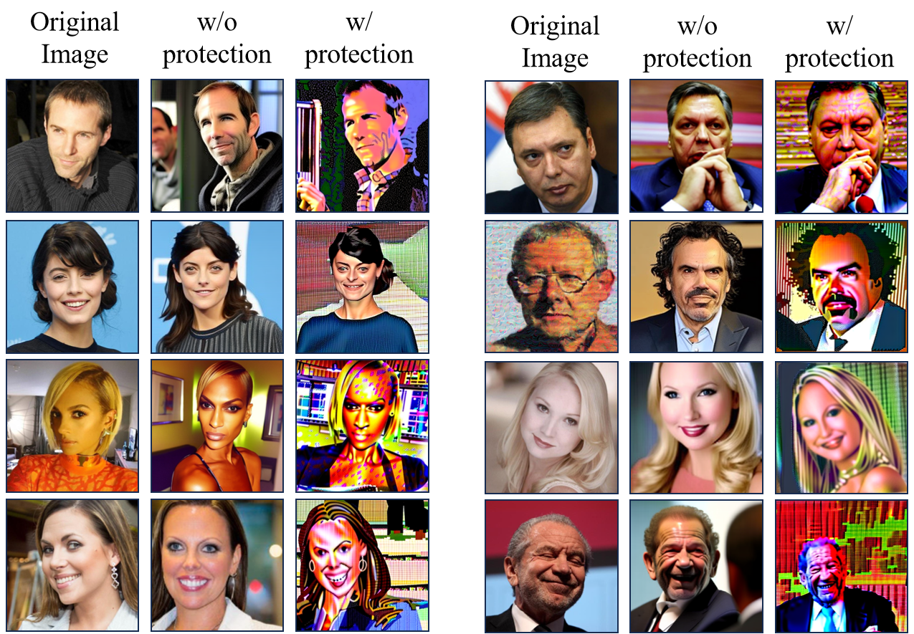
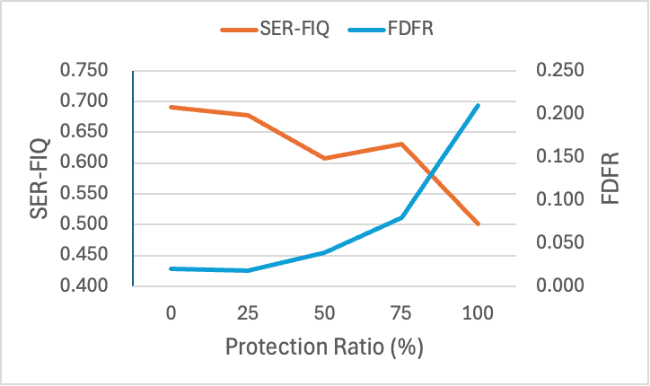
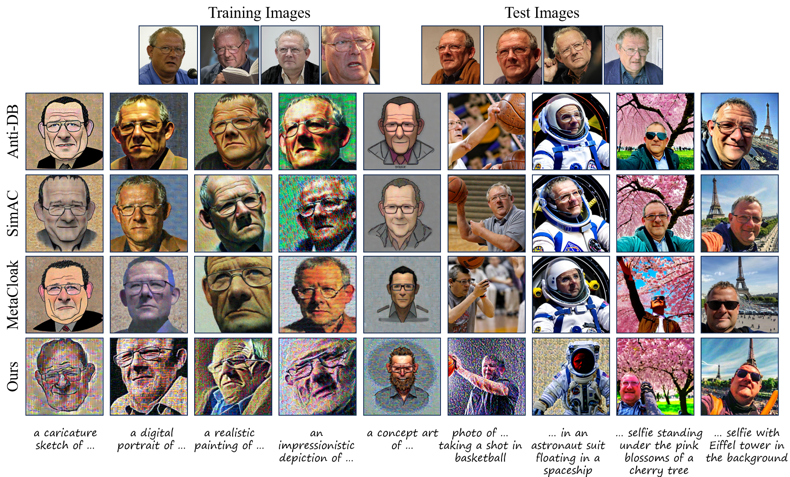
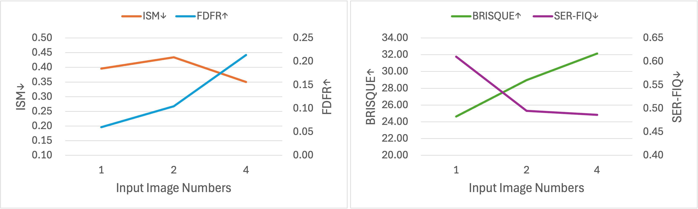

# ID-Cloak: Crafting Identity-Specific Cloaks Against Personalized Text-to-Image Generation

---
### **Figure R1: Our protection's effectiveness against tuning-free personalization method**  

  

---
### **Figure R2: Results of ID-cloak with different protection ratios.**  

  

---
### **Figure R3: Qualitative comparison on more complex and diverse prompts.**  

  

---
### **Figure R4: Ablation study on effect of input image numbers on ID-cloak performance.**  

  

